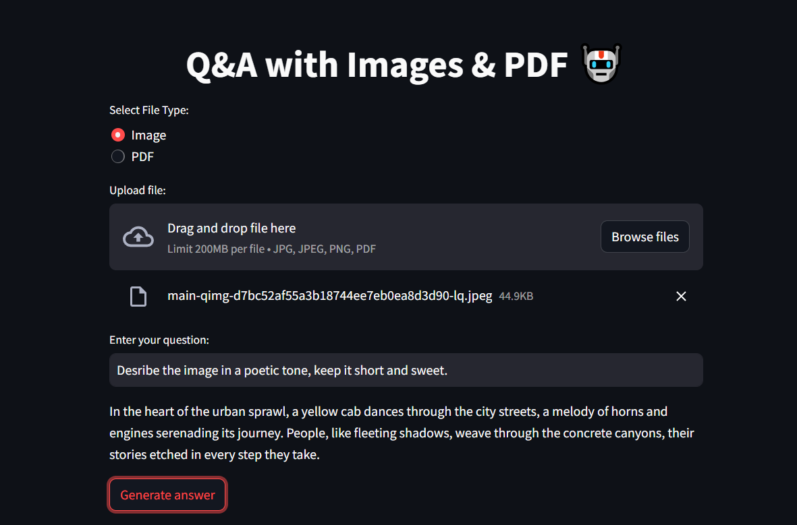
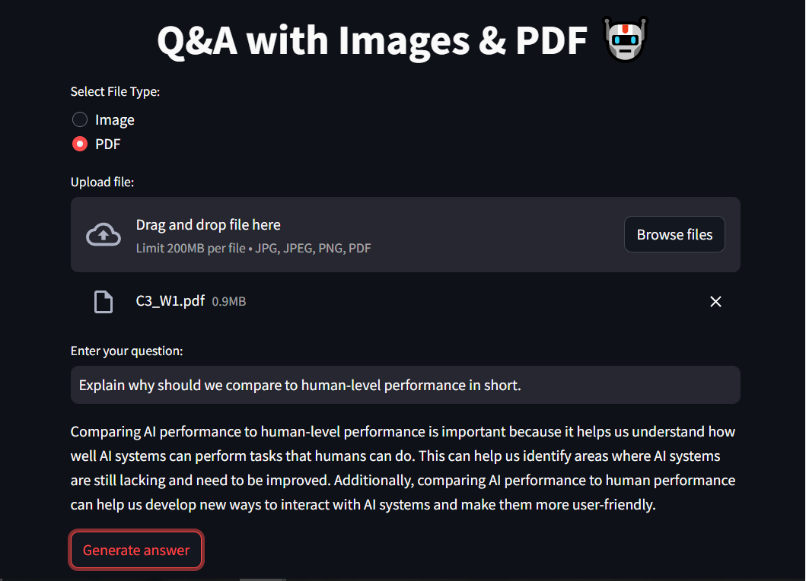

# Q&A with Images and PDF

## Description

The "Q&A with Images and PDF" project is a question-answering system that intelligently responds to user queries based on both image and PDF input. Leveraging advanced machine learning models and natural language processing techniques, this system aims to provide accurate and comprehensive answers to diverse questions.

### Technologies Used

- **Hugging Face Transformers Library:** Utilized for language model generation and content embeddings.

- **Google Generative AI API:** Integrated to generate informative answers using advanced language models.

- **Streamlit:** Employed for building an interactive user interface, enabling users to upload images and PDFs and receive responses to their queries.

- **PyPDF2:** Used to extract text from PDF documents.

- **Facebook DETR (DEtection TRansformers) Model:** Implemented for object detection in images.

- **OpenAI Embeddings and LangChain Libraries:** Used for additional language processing tasks.

## Examples
### Generation with Images:

### Generation with PDF:

## Methodology

The project follows a comprehensive methodology for both image and PDF processing:

1. **Image Processing:**
   - Utilizes image captioning models for generating textual descriptions of images.
   - Implements object detection to identify and list objects present in the image.

2. **PDF Processing:**
   - Creates a content vector store by extracting text from each page of the PDF.
   - Uses document embeddings to represent the content of each page efficiently.

3. **Answer Generation:**
   - Integrates with Google's Generative AI API for generating detailed and informative answers to user queries.
   - Employs a user-friendly and conversational tone in responses.

For further details and instructions, refer to the documentation and codebase.
